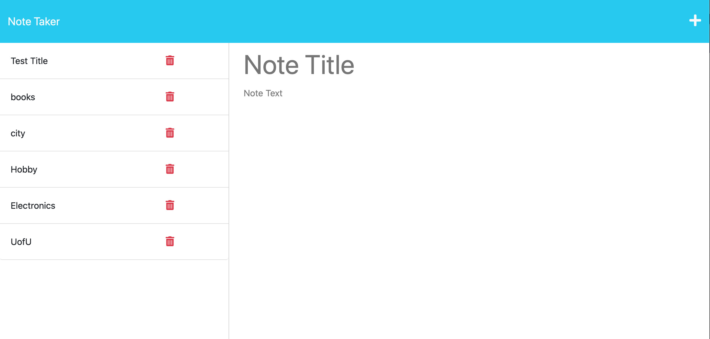

# NOTE-REGISTER 
Express.js Note Taker

## Description
    This application called Note Taker enables users that to write and save notes. This application will use an Express.js back end and will save and retrieve note data from a JSON file. And then deployed the entire application to Heroku.

## Tables of content:
  * [Installation](#installation)
  * [Usage](#usage)
  * [License](#license)
  * [Contributors](#contributors)
  * [Test](#test)
  * [Questions](#questions)

## Installation

1. Install NODE.js to run this application
2. Create a .gitignore file and include node_modules/ and .DS_Store/ so that your node_modules directory isn't tracked or uploaded to GitHub. Be sure to create your .gitignore file before installing any npm dependencies.
3. Make sure that your repo includes a package.json with the required dependencies. You can create one by running npm init when you first set up the project, before installing any dependencies.
4. Run command npm i inquirer@8.2.4 from the integrated terminal to install inquirer.js package dependency.
5. Run command npm npm i express to install express package.
6. Run command npm i uuid to install uuid package to generate unique id.
7. The application will be invoked by using the following command: node server.js.This will start localhost server on PORT 3001.
8. Open browser and type http://localhost:3001/ to run this application on your local machine.

## Usage 
1. When opening the deployed Note Taker application, the user is presented with a landing page with links to a note page.
2. When clicked on  get started button, user is presented with a page with existing notes listed in the left-hand column, plus empty fields to enter a new note title and the note's text in the right-hand column.
3. When the user enters a new note title and text, then a Save icon appears in the navigation bar at the top of the page.
4. When the user clicks on the Save icon, then the new note is saved and appears in the left-hand column with the other existing notes.
5. When an existing note in the list in the left-hand column is clicked, then that note appears in the right-hand column.
6. When the user clicks the Write icon in the navigation bar at the top of the page, then they are presented with empty field to enter a new note title and text in the right-hand column.

## License  
* This application is licensed under : 
* Click the link for the detailed license information: https://choosealicense.com/licenses/isc/

## Contributors
shruthi

## Test
npm test

## Questions
  * GitHub Username : shruthisalimath
  * Email: shruthi@test.com
  * GitHub profile : https://github.com/shruthisalimath 

## Mock Up

## ScreenShot

## URL
1. The URL of the Deployed Heroku.

2.The URL of the GitHub repository.
https://github.com/shruthisalimath/Note-Register

